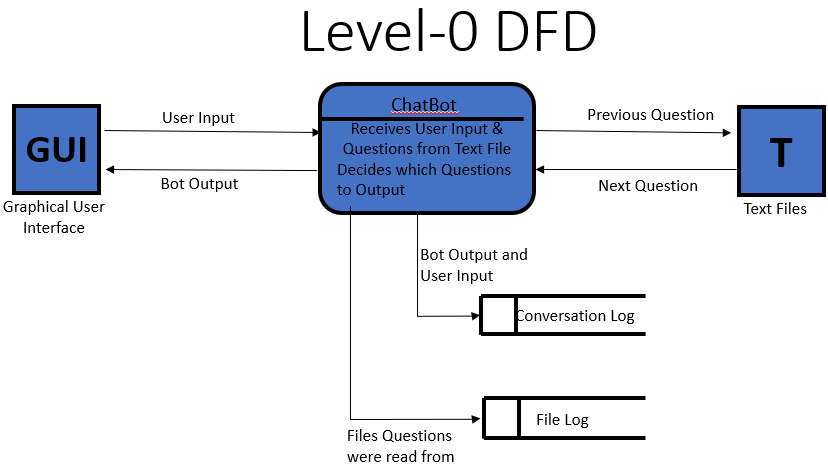
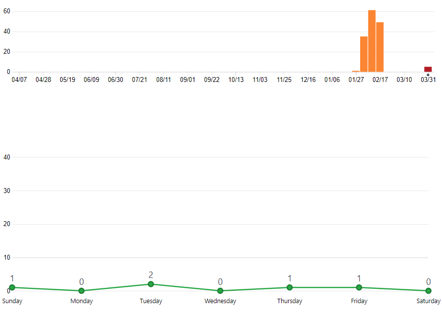

COSC310-Assignment3 - Daulton Baird

Cloned from Assignment 2 ReadMe:

  The purpose of the program we created is to assist users in solving their technology problems. This chatbot is similar to ones you would see on websites such as TELUS where the chatbot leads the user through a series of questions in order to attempt to solve the users tech problems. In order to run the program in eclipse you will need to complete the following steps:

  1.	Download and install Eclipse.
  2.	In your browser, open the URL for the github repository , click accept, click the URL then click Clone and copy the URL
  3.	In Eclipse, File - import - git - projects from Git - clone URI then enter the URI.

  To run the chatbot you need to run Run.java. There are 1 classes in this project : DecisionMatrix.java, EdgeBuilder.java, Question.java, QuestionBuilder.java, QuestionBuilderTest.java, Run.java, StackHandler.java, Testing.java, Tree.java, and UserInput.java. DecisionMatrix.java is the program that decides what the program does for a given input. For example, if the user answers a question in a way that the program does not understand, it will respond by saying, “Did not understand that, please try again”. It also determines whether or not the program is finished or needs to keep going. EdgeBuilder.java Takes an ArrayList of unlinked questions (children nodes empty), and links all of the nodes together using branchID and questionPriority. Question.java contains info from individual question file. QuestionBuilder.java gets all question files in a specified directory and reads them into new Question objects while QuestionBuilderTest.java tests it. StackHandler.java ensures that the stack we have created runs smoothly. Testing.java is the main testing class. Tree.java creates a tree that holds the questions. UserInput.java is all the answers that the user inputs. Finally, Run.java is the main class that runs the chatbot.

Assignment 3 Changes:

Programming:

  1. Added JFrame GUI so that the conversation is much more visually appealing
  2. Added 5 different error messages for the ChatBot to output is the user enters something outside of the expected answers
  3. Removed EdgeBuilder class as it was not being used
  4. Added "TV" topic
  5. Added SpellChecker class that checks letter-by-letter to see which word from a dictionary is closest to the user’s input and provides a suggested word to correct the input to.
  
  Documentation:
 
 The Level 0 DFD above shows the main input and output of the chatbot. The chatbot reads a Question from a text file, recieves user input (a response) and selects the next question based on that response.
 
 
 
 The Level 1 DFD above shows the actual processes that the user input goes through when it is running. The diagram shows the data path starting from the Question in the text file, to the Questions class which builds a Hashmap of Questions to be used in the Tree class. Once the Tree is built, the Run class recieves it and the Question is printed. The response is received from the user through the GUI class and read via a Scanner in the User Input class. The Run class sends the User Input to the Decision Matrix class which decides which question is outputted next. The Stack Helper class logs both the conversation between the bot and the user and the files from which the questions are read so that the path the user took may be viewed later.
 
 
  This is my GitHub Graph
  
 
 This sample output shows the SpellChecker additon, some of the different error responses, and the new tv topic 
  
  
  API Features:
  
- Question/Question Builder class: The Question and QuestionBuilder classes could be used in an API to read in questions stored in a text file so that they can be used in a program.
- TextFileMaker class: The TextFileMaker class could be used as an API if the User needed to make individual text files storing a question or data that needs to be read into the program.
- StackHandler class: The StackHandler class could be used as an API if the user wishes to keep track of input and output of a program and the files that were read/written to.
- SpellChecker class: The SpellChecker class could be used as an API if the user wanted a spell checker that checks individual words one at a time.
-	DecisionMatrix class: The DecisionMatrix class could be used as an API if the user needs a class that selects which file to use next based on some decision or user input.
